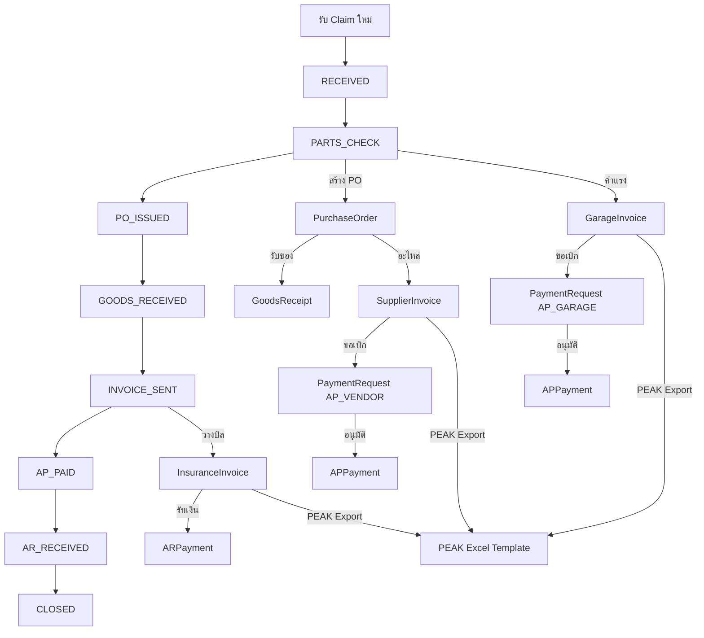

# Expert Body & Paint — Skill Code / Architecture Document

> **Last Updated:** 2026-05-17  
> **System:** Insurance Claim Management + PEAK Accounting Integration  
> **Stack:** Next.js 16 (App Router) • Prisma 7 • PostgreSQL • Cloudflare R2

---

## ⚠️ CRITICAL RULES

### วันที่ — ใช้ **พ.ศ. (Buddhist Era)** ทั้งระบบ
- **Display:** ทุก text แสดงวันที่ต้องใช้ `formatDate()` / `formatDateTime()` จาก `lib/date.ts` → แสดง **พ.ศ.** เสมอ (เช่น 17/05/2569)
- **DB:** เก็บเป็น ISO/AD (ค.ศ.) ปกติ ไม่ต้องแปลง
- **HTML Date Input:** `<input type="date">` แสดง ค.ศ. ตามระบบ (ควบคุมไม่ได้) แต่เมื่อบันทึกแล้วต้องแสดงเป็น พ.ศ.
- **ห้าม** ใช้ `toLocaleDateString()` หรือ format วันที่เองตรงๆ — ใช้ `lib/date.ts` เท่านั้น

### ห้ามใช้ Native JavaScript Dialog — ใช้ Modal เท่านั้น
- **ห้าม** ใช้ `alert()`, `confirm()`, `prompt()` ในทุกกรณี
- **ยืนยัน/ลบ:** ใช้ `setConfirmModal({ title, message, onConfirm })` state ที่มีอยู่ใน `page.tsx` หรือ `ConfirmDialog` จาก `@/components/dialogs.tsx`
- **แจ้งเตือน:** ใช้ `showToast(msg)` (สำเร็จ) หรือ `setErrorModalMsg(msg)` (error)
- **ทุก tab component** รับ `setConfirmModal` ผ่าน `ClaimTabProps`

### Number Input — ป้องกัน Leading Zero
- **ห้าม** ใช้ `value={number}` กับ `<Input type="number">` ตรงๆ → จะเกิด leading zero (เช่น "02000")
- **ใช้** `value={number || ''}` → เมื่อ value เป็น 0 จะแสดงช่องว่าง ให้ user พิมพ์ตัวเลขใหม่ได้สะอาด

---

## 1. Folder Structure

```
src/
├── app/
│   ├── api/                     # Route Handlers (REST API)
│   │   ├── ai/                  # AI extraction endpoints
│   │   ├── claims/[id]/         # Claim CRUD + sub-resources
│   │   ├── dashboard/           # Dashboard stats
│   │   ├── insurances/          # Insurance CRUD
│   │   ├── invoices/            # AR Invoice list + status
│   │   ├── parts-master/        # Parts catalog
│   │   ├── payment-requests/    # PR create + approve/reject
│   │   ├── payments/            # Payment management
│   │   ├── peak/                # PEAK sync list + export
│   │   ├── reports/             # Report endpoints (with filter support)
│   │   ├── stats/               # Sidebar badge counts
│   │   ├── upload/              # File upload to R2
│   │   └── vendors/             # Vendor CRUD
│   ├── claims/                  # Claims pages
│   │   ├── page.tsx             # Claims list (196 lines)
│   │   ├── new/page.tsx         # New claim form
│   │   └── [id]/
│   │       ├── page.tsx         # Claim detail (~1,595 lines, reduced from 1,832)
│   │       ├── tabs/            # Extracted tab components
│   │       │   ├── index.ts     # Barrel export
│   │       │   ├── types.ts     # Shared ClaimTabProps interface
│   │       │   ├── ClaimInfoTab.tsx
│   │       │   ├── PnLTab.tsx
│   │       │   ├── TimelineTab.tsx
│   │       │   ├── PaymentsTab.tsx
│   │       │   └── InsuranceInvoiceTab.tsx
│   │       └── pdf/[type]/      # PDF generation pages
│   ├── dashboard/page.tsx       # Dashboard
│   ├── insurances/              # Insurance management
│   ├── invoices/page.tsx        # AR Invoice list (259 lines)
│   ├── payments/page.tsx        # Payment approvals (267 lines)
│   ├── peak/page.tsx            # PEAK sync dashboard (339 lines)
│   ├── reports/                 # Reports (with filter + Excel export)
│   ├── settings/                # System settings
│   ├── vendors/                 # Vendor management
│   ├── layout.tsx               # Root layout
│   └── globals.css              # Global styles
├── components/
│   ├── sidebar.tsx              # Main sidebar nav (dynamic counts)
│   ├── topbar.tsx               # Top navigation bar
│   ├── client-layout.tsx        # Client-side layout wrapper (+ ToastProvider)
│   ├── toast-provider.tsx       # Global toast notification system
│   ├── dialogs.tsx              # Shared ConfirmDialog + ErrorDialog
│   └── ui/                      # shadcn/ui components
├── lib/
│   ├── prisma.ts                # Prisma singleton
│   ├── date.ts                  # Centralized date formatting (AD/ค.ศ.)
│   ├── types.ts                 # TypeScript interfaces (552 lines)
│   ├── utils.ts                 # Utility functions (70 lines)
│   ├── upload.ts                # R2 upload helper
│   ├── r2.ts                    # R2 client config
│   └── mock/                    # Legacy mock data (NO LONGER IMPORTED — can be deleted)
└── prisma/
    └── schema.prisma            # Database schema (562 lines, 30+ models)
```

---

## 2. Data Flow Overview



---

## 3. API Route Registry

| Route | Method | Purpose | Data Source |
|-------|--------|---------|-------------|
| `/api/claims` | GET/POST | List/Create claims | Prisma ✅ |
| `/api/claims/[id]` | GET/PUT | Claim detail/update | Prisma ✅ |
| `/api/claims/[id]/status` | PATCH | Change claim status | Prisma ✅ |
| `/api/claims/[id]/pos` | GET/POST | Purchase orders | Prisma ✅ |
| `/api/claims/[id]/pos/[poId]` | PUT/PATCH | Edit/cancel PO | Prisma ✅ |
| `/api/claims/[id]/supplier-invoices` | POST | Create supplier invoice | Prisma ✅ |
| `/api/claims/[id]/garage-invoices` | POST | Create garage invoice | Prisma ✅ |
| `/api/claims/[id]/insurance-invoice` | POST/DELETE | Create/cancel AR invoice | Prisma ✅ |
| `/api/claims/[id]/insurance-invoice/receive-payment` | POST | Record AR payment | Prisma ✅ |
| `/api/claims/[id]/quotations` | POST/PUT | Create/update quotation | Prisma ✅ |
| `/api/claims/[id]/peak-export` | GET | Per-claim PEAK export | Prisma ✅ |
| `/api/claims/[id]/parts` | GET/POST | Claim parts | Prisma ✅ |
| `/api/claims/[id]/labors` | GET/POST | Claim labors | Prisma ✅ |
| `/api/claims/[id]/payments` | GET | Claim payments | Prisma ✅ |
| `/api/claims/[id]/pnl` | GET | Claim P&L | Prisma ✅ |
| `/api/invoices` | GET | AR invoice list | Prisma ✅ |
| `/api/invoices/[id]/status` | PUT | Update AR status | Prisma ✅ |
| `/api/payment-requests` | POST | Create payment request | Prisma ✅ |
| `/api/payment-requests/[id]/approve` | POST | Approve PR | Prisma ✅ |
| `/api/payment-requests/[id]/reject` | POST | Reject PR | Prisma ✅ |
| `/api/payments` | GET | Payment requests list | Prisma ✅ |
| `/api/payments/[id]` | PUT | Update payment status | Prisma ✅ |
| `/api/peak` | GET | PEAK sync list (AR + AP) | Prisma ✅ |
| `/api/peak/export` | POST | Export PEAK Excel data | Prisma ✅ |
| `/api/peak-export/batch` | GET | Batch PEAK export | Prisma ✅ |
| `/api/dashboard/summary` | GET | Dashboard KPIs | Prisma ✅ |
| `/api/dashboard/by-status` | GET | Claims by status | Prisma ✅ |
| `/api/dashboard/by-insurance` | GET | Revenue by insurance | Prisma ✅ |
| `/api/reports` | GET | Reports (filter: year, insurance, vendor) | Prisma ✅ |
| `/api/stats` | GET | Sidebar badge counts | Prisma ✅ |
| `/api/vendors` | GET/POST | Vendor CRUD | Prisma ✅ |
| `/api/insurances` | GET/POST | Insurance CRUD | Prisma ✅ |
| `/api/parts-master` | GET/POST | Parts catalog | Prisma ✅ |
| `/api/upload` | POST | File upload to R2 | R2 ✅ |

> **🎉 ALL API ROUTES NOW USE PRISMA — ZERO MOCK DATA DEPENDENCIES**

---

## 4. Bug Report — Completed Fixes

### ✅ Fixed (2026-05-17)

| # | Fix | Status |
|---|-----|--------|
| 1 | Removed dead `mockPaymentRequests` import from `claims/[id]/page.tsx` | ✅ Done |
| 2-8 | Migrated all 10 mock-dependent API routes to Prisma | ✅ Done |
| 9 | `settings/page.tsx` — migrated from mock to API fetch | ✅ Done |
| 10 | `pdf/[type]/page.tsx` — removed mock company profile | ✅ Done |
| 11 | Replaced all 4 `window.location.reload()` with `refreshClaim()` | ✅ Done |
| 14 | `handleSendQuotation` now persists to DB via PUT | ✅ Done |
| 15 | Supplement SUPERSEDED status now persisted to DB | ✅ Done |
| 16 | `xlsx` changed to dynamic import on both PEAK + Reports pages | ✅ Done |
| R1 | Reports: Added global filter bar (year/insurance/vendor) | ✅ Done |
| R2 | Reports: Added Export Excel button for all 4 report tabs | ✅ Done |
| R3 | Reports: Removed all `Math.random()`, replaced with real Prisma data | ✅ Done |
| R4 | Reports: Added per-tab search, summary cards, summary rows | ✅ Done |
| Q1 | Added PUT handler for quotations API (status updates) | ✅ Done |

### 🟡 Remaining (Lower Priority)

| # | File | Issue | Impact |
|---|------|-------|--------|
| 12 | `claims/[id]/page.tsx:169` | **Non-unique PO number** — uses `purchaseOrders.length + 1`. | Duplicate PO numbers possible |
| 13 | `claims/[id]/page.tsx:306` | **Non-unique QT number** — same pattern for quotations. | Duplicate QT numbers possible |
| 17 | `sidebar.tsx` | **No retry for stats fetch** — Silent failure shows 0 badges. | Silent failure |
| 18 | `claims/[id]/page.tsx` | **~1,810 lines single component** — 8 tabs, 7 modals, 30+ state vars. | Maintainability |
| 19 | Multiple pages | **Toast duplicated** — Each page implements its own toast pattern. | Code duplication |
| 20 | Multiple pages | **Modal duplicated** — Error/confirm modal patterns copy-pasted. | Code duplication |
| 21 | `types.ts` usage | **`any` used 15+ times** — `useState<any[]>()` everywhere. | Type safety |
| 22 | `invoices/page.tsx:96` | **eslint-disable** suppresses `exhaustive-deps`. | Lint suppression |

---

## 5. Componentization Opportunities

### Priority 1 — Extract Immediately

| Component | Current Location | Benefit |
|-----------|-----------------|---------|
| **`<Toast />`** | Inline in every page | Used in 5+ pages. Create global provider with `useToast()` hook. |
| **`<ConfirmModal />`** | `claims/[id]/page.tsx:1684` | Generic confirm modal exists inline. Extract to `components/ui/confirm-modal.tsx`. |
| **`<ErrorModal />`** | `claims/[id]/page.tsx:1666` | Same pattern in 3 pages. Extract to `components/ui/error-modal.tsx`. |
| **`<StatusBadge />`** | Inline everywhere | `getStatusColor` + `getStatusLabel` combo used 10+ places. Create `<StatusBadge status="..." />`. |
| **`<Money />`** | Inline everywhere | `฿${formatCurrency(amount)}` pattern repeated 50+ times. |

### Priority 2 — Break Up God Component

The `claims/[id]/page.tsx` (~1,810 lines) should be split into:

| New Component | Lines to Extract | Description |
|---------------|-----------------|-------------|
| `ClaimInfoTab.tsx` | ~560-600 | Tab 1: Claim + car info |
| `PartsLaborTab.tsx` | ~602-780 | Tab 2: Parts/labor tables + quotation |
| `PurchaseOrderTab.tsx` | ~783-901 | Tab 3: PO list + actions |
| `SupplierInvoiceTab.tsx` | ~903-1225 | Tab 4: Supplier invoices + upload |
| `InsuranceInvoiceTab.tsx` | ~1228-1321 | Tab 5: AR billing |
| `PaymentsTab.tsx` | ~1323-1392 | Tab 6: Payment requests |
| `PnLTab.tsx` | ~1394-1423 | Tab 7: Profit & Loss |
| `TimelineTab.tsx` | ~1425-1458 | Tab 8: Status timeline |
| `CreatePOModal.tsx` | ~1553-1621 | PO creation modal |
| `CreateQuotationModal.tsx` | ~1461-1551 | Quotation creation modal |

### Priority 3 — Shared Data Table

| Component | Pages Using | Benefit |
|-----------|-------------|---------|
| **`<DataTable />`** | Claims, Invoices, Payments, PEAK Sync | Generic table with sorting, search, pagination. |

---

## 6. Best Practices Improvements

### 6.1 ~~Remove All Mock Data Dependencies~~ ✅ COMPLETED

All 10 mock-dependent API routes + 3 page components now use Prisma.
The `lib/mock/` directory is no longer imported anywhere and can be safely deleted.

### 6.2 API Error Handling ✅ IMPLEMENTED

All new/rewritten API routes now use try/catch with proper error responses.

### 6.3 ~~Replace `window.location.reload()` with State Refresh~~ ✅ COMPLETED

`refreshClaim()` function added to claims detail page. All 4 reload calls replaced.

### 6.4 ~~Dynamic Import for `xlsx`~~ ✅ COMPLETED

Both PEAK page and Reports page now use `await import('xlsx')` for dynamic loading.

### 6.5 Proper Document Number Generation (TODO)

**Current (collision-prone):**
```typescript
const poNo = `PO-${new Date().getFullYear()}-${String(purchaseOrders.length + 1).padStart(4, '0')}`
```

**Recommended — use `DocumentSequence` model already in schema:**
```typescript
const seq = await prisma.documentSequence.update({
  where: { docType: 'PO' },
  data: { lastNo: { increment: 1 } },
})
const poNo = `${seq.prefix}${String(seq.lastNo).padStart(4, '0')}`
```

### 6.6 Type Safety (TODO)

Replace all `useState<any[]>([])` with proper types from `types.ts`:

```typescript
// Bad
const [parts, setParts] = useState<any[]>([])

// Good  
const [parts, setParts] = useState<ClaimPart[]>([])
```

### 6.7 Create Shared `useFetch` Hook (TODO)

```typescript
// hooks/useFetch.ts
export function useFetch<T>(url: string) {
  const [data, setData] = useState<T | null>(null)
  const [loading, setLoading] = useState(true)
  const [error, setError] = useState<string | null>(null)

  const refetch = useCallback(async () => {
    setLoading(true)
    try {
      const res = await fetch(url)
      if (!res.ok) throw new Error(`HTTP ${res.status}`)
      setData(await res.json())
    } catch (e: any) {
      setError(e.message)
    } finally {
      setLoading(false)
    }
  }, [url])

  useEffect(() => { refetch() }, [refetch])
  return { data, loading, error, refetch }
}
```

---

## 7. Prisma Schema Notes

### Key Relations
- `Claim` is the central entity linking to all sub-resources
- `InsuranceInvoice` is **1:1** with `Claim` (`@unique` on `claimId`)
- `PaymentRequest` links to either `SupplierInvoice`, `GarageInvoice`, or `InsuranceInvoice`
- `APPayment` and `ARPayment` are **1:1** with their respective invoice types
- `DocumentSequence` model exists but is **not yet used** — should be adopted

### Missing Indexes (Performance)
Consider adding indexes on frequently queried fields:
- `PaymentRequest.status` — filtered in sidebar + payments page
- `InsuranceInvoice.status` — filtered in invoices page + peak sync
- `Claim.status` — filtered in claims list

---

## 8. PEAK Integration Architecture

### Export Flow
1. User selects invoices on `/peak` page
2. Frontend calls `POST /api/peak/export` with `{ type: 'ar'|'ap', ids: [...] }`
3. API fetches invoices from Prisma, maps to PEAK template columns
4. Returns JSON rows + filename
5. Frontend converts to Excel using `xlsx` library (dynamically imported)
6. Browser downloads the `.xlsx` file

### Template Columns (from real PEAK templates)

**AR (template_ar.xlsx):**
```
ลำดับที่* | วันที่เอกสาร | เลขที่เอกสาร | อ้างอิงถึง | ลูกค้า | 
เลขทะเบียน 13 หลัก | เลขสาขา 5 หลัก | เป็นใบกำกับภาษี | ประเภทราคา | 
สินค้า/บริการ | บัญชี | คำอธิบาย | จำนวน | ราคาต่อหน่วย | ส่วนลดต่อหน่วย | 
อัตราภาษี | ถูกหัก ณ ที่จ่าย(ถ้ามี) | หมายเหตุ | กลุ่มจัดประเภท
```

**AP (template_ap.xlsx):**
```
ลำดับที่* | วันที่เอกสาร | อ้างอิงถึง | ผู้รับเงิน/คู่ค้า | 
เลขทะเบียน 13 หลัก | เลขสาขา 5 หลัก | เลขที่ใบกำกับฯ (ถ้ามี) | 
วันที่ใบกำกับฯ (ถ้ามี) | วันที่บันทึกภาษีซื้อ (ถ้ามี) | ประเภทราคา | 
สินค้า/บริการ | บัญชี | คำอธิบาย | จำนวน | ราคาต่อหน่วย | อัตราภาษี | 
หัก ณ ที่จ่าย (ถ้ามี) | ชำระโดย | จำนวนเงินที่ชำระ | ภ.ง.ด. (ถ้ามี) | 
หมายเหตุ | กลุ่มจัดประเภท
```

### Account Codes
```
ACCOUNT_REVENUE_LABOR = '41101'  // รายได้ค่าแรง
ACCOUNT_REVENUE_PARTS = '41102'  // รายได้ค่าอะไหล่
ACCOUNT_COST_LABOR    = '51101'  // ต้นทุนค่าแรง
ACCOUNT_COST_PARTS    = '51102'  // ต้นทุนค่าอะไหล่
```

---

## 9. Improvement Roadmap

| Phase | Task | Status |
|-------|------|--------|
| **Phase 1** | ~~Remove all mock data from API routes, migrate to Prisma~~ | ✅ Done |
| **Phase 3** | ~~Split `claims/[id]/page.tsx` into tab components~~ | ✅ Done (5 tabs extracted) |
| **Phase 4** | ~~Replace `window.location.reload()` with state refresh~~ | ✅ Done |
| **Phase 5** | ~~Fix PO/QT/INV collision-prone numbering (timestamp-based)~~ | ✅ Done |
| **Phase 6** | Add proper TypeScript types (remove `any`) | 🔲 Pending |
| **Phase 7** | ~~Dynamic import `xlsx`, optimize bundle~~ | ✅ Done |
| **Phase 8** | ~~Create shared Toast + ConfirmDialog + ErrorDialog~~ | ✅ Done |
| **Phase 9** | Add DB indexes for performance | 🔲 Pending |
| **Phase 10** | ~~Reports: Add Filter + Export Excel~~ | ✅ Done |
| **Phase 11** | ~~Reports: Fix fake data (Math.random)~~ | ✅ Done |
| **Phase 12** | ~~Reports: Add Income/Expense Detail tab~~ | ✅ Done |
| **Phase 13** | ~~Date format standardization (ค.ศ. AD system-wide)~~ | ✅ Done |
| **Phase 14** | ~~Insurance Invoice: Add PDF/PEAK download buttons~~ | ✅ Done |
| **Phase 15** | ~~AR Receive: Add date picker for payment date~~ | ✅ Done |

---

## 10. Environment & Deploy

- **Dev:** `npm run dev` → `http://localhost:3000`
- **Deploy:** `git push` → `bash deploy.sh` (SSH + Docker multi-stage build)
- **DB:** PostgreSQL via `DATABASE_URL`
- **Storage:** Cloudflare R2 via `R2_*` env vars
- **AI:** Claude/OpenRouter via `ANTHROPIC_API_KEY` or `OPENROUTER_API_KEY`
