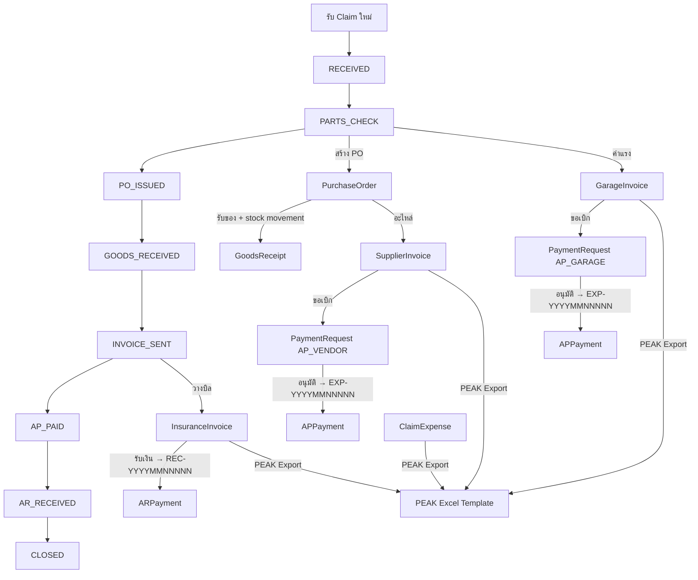

# SSM — Skill Code / Architecture Document

> **Last Updated:** 2026-05-27
> **System:** Insurance Claim Management + PEAK Accounting Integration
> **Stack:** Next.js 14.2.35 (App Router) • Prisma 5 • PostgreSQL • Cloudflare R2
> **Total Source:** ~19,600 lines across ~90 files

---

## ⚠️ CRITICAL RULES

### วันที่ — ใช้ **พ.ศ. (Buddhist Era)** ทั้งระบบ
- **Display:** ทุก text แสดงวันที่ต้องใช้ `formatDate()` / `formatDateTime()` จาก `lib/date.ts` → แสดง **พ.ศ.** เสมอ (เช่น 17/05/2569)
- **DB:** เก็บเป็น ISO/AD (ค.ศ.) ปกติ ไม่ต้องแปลง
- **Date Picker:** ใช้ `<ThaiDatePicker>` จาก `@/components/ui/thai-date-picker.tsx` — แสดงปี พ.ศ. ใน calendar popup
- **HTML Date Input:** `<input type="date">` แสดง ค.ศ. ตามระบบ (ควบคุมไม่ได้) แต่เมื่อบันทึกแล้วต้องแสดงเป็น พ.ศ.
- **ห้าม** ใช้ `toLocaleDateString()` หรือ format วันที่เองตรงๆ — ใช้ `lib/date.ts` เท่านั้น

### ห้ามใช้ Native JavaScript Dialog — ใช้ Modal เท่านั้น
- **ห้าม** ใช้ `alert()`, `confirm()`, `prompt()` ในทุกกรณี
- **ยืนยัน/ลบ:** ใช้ `setConfirmModal({ title, message, onConfirm })` state ที่มีอยู่ใน `page.tsx` หรือ `ConfirmDialog` จาก `@/components/dialogs.tsx`
- **แจ้งเตือน:** ใช้ `showToast(msg)` (สำเร็จ) หรือ `setErrorModalMsg(msg)` (error)
- **ทุก tab component** รับ `setConfirmModal` ผ่าน `ClaimTabProps`

### Number Input — ป้องกัน Leading Zero
- **ห้าม** ใช้ `value={number}` กับ `<Input type="number">` ตรงๆ → จะเกิด leading zero (เช่น "02000")
- **ใช้** `value={number || ''}` → เมื่อ value เป็น 0 จะแสดงช่องว่าง ให้ user พิมพ์ตัวเลขใหม่ได้สะอาด

### การรันเลขเอกสาร (Sequence Number Generation)
- **ห้าม** ใช้ `prisma.model.count()` เพื่อหาจำนวนแถวทั้งหมดมาเป็นฐานในการบวก 1 เป็นเลขลำดับใหม่เด็ดขาด เพราะหากมีการลบเอกสารในระบบออกไปภายหลัง จะทำให้ค่า count ลดลงและได้เลขที่ซ้ำกับเอกสารเดิม เกิด Error Unique Constraint ได้
- **ให้ใช้** การคิวรี่หาแถวล่าสุดที่เลขสูงที่สุด (เช่น `findFirst` กรองด้วย `startsWith` แล้วเรียง `orderBy` ของฟิลด์รหัสแบบ `desc`) จากนั้นดึงเลขต่อท้ายมาบวกเพิ่มทีละ 1

### Database Migrations — ห้ามรัน Auto

- **ห้าม** AI execute `prisma migrate` หรือ `prisma db push` ในทุกสภาพแวดล้อม โดยไม่แจ้ง developer ก่อน
- ต้องเตรียม schema changes แล้วแจ้ง developer ให้ approve ก่อน trigger migration

### Deployment — ห้ามรัน Auto
- **ห้าม** AI deploy to production โดยไม่ได้รับคำสั่ง "deploy" จาก user อย่างชัดเจน

---

## 1. Folder Structure

```
src/
├── app/
│   ├── api/                     # Route Handlers (REST API) — 20 directories
│   │   ├── ai/                  # AI extraction (claim PDF + supplier invoice)
│   │   │   ├── extract-claim/route.ts         # Claude AI claim extraction (259 lines)
│   │   │   └── extract-supplier-invoice/route.ts # AI supplier invoice extraction
│   │   ├── auth/                # Authentication endpoints
│   │   │   ├── login/route.ts   # JWT login (cookie-based, 8hr expiry)
│   │   │   ├── logout/route.ts  # Clear session cookie
│   │   │   ├── me/route.ts      # Get current user info
│   │   │   └── debug/route.ts   # Auth debug endpoint
│   │   ├── claims/              # Claim CRUD + 13 sub-resource endpoints
│   │   │   ├── route.ts         # GET list / POST create (187 lines)
│   │   │   └── [id]/
│   │   │       ├── route.ts     # GET detail (deep include) / PUT update (192 lines)
│   │   │       ├── status/      # PATCH claim status
│   │   │       ├── parts/       # Claim parts CRUD
│   │   │       ├── labors/      # Claim labors CRUD
│   │   │       ├── pos/         # Purchase orders + [poId]/route.ts + [poId]/gr/ (GR with stock movement)
│   │   │       ├── quotations/  # Quotation CRUD + status
│   │   │       ├── supplier-invoices/ # Supplier invoice create
│   │   │       ├── garage-invoices/   # Garage invoice create
│   │   │       ├── insurance-invoice/ # AR invoice create/delete + receive-payment/
│   │   │       ├── expenses/    # Additional expenses CRUD
│   │   │       ├── documents/   # Document attachments CRUD
│   │   │       ├── payments/    # Claim payments list
│   │   │       ├── pnl/         # Claim P&L calculation
│   │   │       └── peak-export/ # Per-claim PEAK export (250 lines)
│   │   ├── dashboard/           # Dashboard KPIs (summary, by-status, by-insurance)
│   │   ├── garages/             # Garage vendor list (14 lines)
│   │   ├── gr/[id]/             # Goods receipt by ID
│   │   ├── insurances/          # Insurance CRUD + [id]/route.ts
│   │   ├── invoices/            # AR invoice list + [id]/status + batch + batch-status + next-bn
│   │   ├── parts-master/        # Parts catalog CRUD + [id]/route.ts
│   │   ├── payment-requests/    # PR create + [id]/approve + [id]/reject
│   │   ├── payments/            # Payment list + [id]/route.ts + ap/ + ar/
│   │   ├── peak/                # PEAK sync list + export/ + update-doc-no/
│   │   ├── peak-export/         # Batch PEAK export
│   │   ├── pos/[id]/            # PO status + GR endpoints
│   │   ├── reports/             # Report data (filter: year, insurance, vendor)
│   │   ├── settings/            # Company profile + sequences
│   │   ├── stats/               # Sidebar badge counts
│   │   ├── upload/              # File upload to R2 (presigned URL / image compression)
│   │   │   └── presigned/
│   │   │       └── route.ts     # PUT presigned URL generator (38 lines)
│   │   ├── users/               # User management CRUD + [id]/route.ts
│   │   └── vendors/             # Vendor CRUD + [id]/route.ts
│   ├── login/page.tsx           # Login page (134 lines)
│   ├── claims/                  # Claims pages
│   │   ├── page.tsx             # Claims list (server-side pagination, 239 lines)
│   │   ├── new/page.tsx         # New claim form with AI extraction (979 lines)
│   │   └── [id]/
│   │       ├── page.tsx         # Claim detail (~2,497 lines — main orchestrator)
│   │       ├── components/      # Extracted modals (PO, Quotation, GR, etc.)
│   │       ├── tabs/            # 7 extracted tab components
│   │       │   ├── index.ts     # Barrel export
│   │       │   ├── types.ts     # Shared ClaimTabProps interface
│   │       │   ├── ClaimInfoTab.tsx      # Tab 1: Claim + car info (205 lines)
│   │       │   ├── ExpensesTab.tsx       # Tab: Additional expenses (243 lines)
│   │       │   ├── DocumentsTab.tsx      # Tab: Document attachments (267 lines)
│   │       │   ├── InsuranceInvoiceTab.tsx # Tab: AR billing (180 lines)
│   │       │   ├── PaymentsTab.tsx       # Tab: Payment requests (94 lines)
│   │       │   ├── PnLTab.tsx           # Tab: Profit & Loss (36 lines)
│   │       │   └── TimelineTab.tsx      # Tab: Status timeline (41 lines)
│   │       └── pdf/[type]/page.tsx       # PDF generation (463 lines)
│   ├── dashboard/page.tsx       # Dashboard with charts (242 lines)
│   ├── insurances/              # Insurance management
│   │   ├── page.tsx             # Insurance list
│   │   └── [id]/page.tsx        # Insurance detail (326 lines)
│   ├── invoices/                # AR Invoice management
│   │   ├── page.tsx             # Invoice list with batch status (513 lines)
│   │   └── print-billing-note/page.tsx  # Billing note print (950 lines)
│   ├── payments/page.tsx        # Payment approvals (356 lines)
│   ├── peak/page.tsx            # PEAK sync dashboard (804 lines)
│   ├── parts-master/            # Parts catalog
│   │   ├── page.tsx             # Parts list with search (534 lines)
│   │   └── [id]/page.tsx        # Part detail + stock movement log (538 lines)
│   ├── reports/page.tsx         # Reports with filter + Excel export (656 lines)
│   ├── settings/page.tsx        # System settings (671 lines)
│   ├── vendors/                 # Vendor management
│   │   ├── page.tsx             # Vendor list
│   │   └── [id]/page.tsx        # Vendor detail (321 lines)
│   ├── layout.tsx               # Root layout (22 lines)
│   ├── page.tsx                 # Redirect to /dashboard (5 lines)
│   └── globals.css              # Global styles (2.7 KB)
├── components/
│   ├── sidebar.tsx              # Main sidebar nav (dynamic counts + role filtering, 213 lines)
│   ├── topbar.tsx               # Top navigation bar with user menu (154 lines)
│   ├── client-layout.tsx        # Client-side layout wrapper + ToastProvider (32 lines)
│   ├── toast-provider.tsx       # Global toast notification system (71 lines)
│   ├── dialogs.tsx              # Shared ConfirmDialog + ErrorDialog (61 lines)
│   └── ui/                      # shadcn/ui + custom components (11 files)
│       ├── badge.tsx            ├── button.tsx
│       ├── card.tsx             ├── dialog.tsx
│       ├── input.tsx            ├── popover.tsx
│       ├── select.tsx           ├── skeleton.tsx    # Loading skeleton helpers
│       ├── table.tsx            ├── tabs.tsx
│       └── thai-date-picker.tsx # พ.ศ. calendar picker (135 lines)
├── lib/
│   ├── prisma.ts                # Prisma singleton (18 lines)
│   ├── auth.ts                  # Auth utilities: hashPassword, verifyPassword, getSession, requireAuth, requireRole (61 lines)
│   ├── jwt.ts                   # Custom JWT sign/verify using Web Crypto API (105 lines)
│   ├── date.ts                  # Centralized date formatting — พ.ศ./ค.ศ. (49 lines)
│   ├── types.ts                 # TypeScript interfaces (589 lines)
│   ├── utils.ts                 # formatCurrency, getStatusColor/Label, cn (63 lines)
│   ├── upload.ts                # R2 direct upload utility + canvas compression (116 lines)
│   ├── r2.ts                    # R2 client config (35 lines)
│   └── mock/                    # Legacy mock data (NOT imported anywhere — safe to delete)
├── middleware.ts                 # Auth + RBAC middleware (113 lines)
└── prisma/
    ├── schema.prisma            # Database schema (654 lines, 32 models)
    ├── seed.ts                  # Legacy seed script
    ├── seed-ssm.ts              # Production seed from Excel templates (210 lines)
    └── migrations/
        └── 0_init/              # Initial migration (baseline)
```

---

## 2. Authentication & Authorization

### Auth Stack
- **JWT-based** cookie authentication (`ssm-token`, httpOnly, 8-hour expiry)
- **Custom JWT implementation** using Web Crypto API (no external JWT library)
- **Password hashing:** `pbkdf2$1000$salt$hash` format using Node's `crypto.pbkdf2Sync`
- **Cookie name:** `ssm-token`

### User Roles
| Role | Access | Sidebar Visibility |
|------|--------|--------------------|
| `ADMIN` | Full access to all features | All menus |
| `ACCOUNTANT` | Invoices, Payments, PEAK, Reports, Dashboard, Parts Master, Insurance, Vendors | No Claims, No Settings |
| `STAFF` | Dashboard, Claims, Insurances, Vendors, Parts Master | No Invoices, Payments, PEAK, Reports, Settings |

### Auth Flow
1. `POST /api/auth/login` → verify password → sign JWT → set cookie
2. `middleware.ts` → decode JWT (no verification, just expiry check) → enforce RBAC
3. API routes use `getSession()` from `lib/auth.ts` for full JWT verification + DB user check
4. `POST /api/auth/logout` → clear cookie
5. `GET /api/auth/me` → return current user info

### Middleware RBAC
- Lightweight JWT decode (no crypto) for fast middleware execution
- Routes `/login`, `/api/auth/*`, `/_next/*`, static files are public
- STAFF restricted to: `/dashboard`, `/claims/*`, `/insurances/*`, `/vendors/*`, `/parts-master/*`
- ACCOUNTANT restricted from: `/settings`, `/api/users`

---

## 3. Data Flow Overview



---

## 4. API Route Registry

| Route | Method | Purpose |
|-------|--------|---------|
| `/api/auth/login` | POST | JWT login with cookie |
| `/api/auth/logout` | POST | Clear session cookie |
| `/api/auth/me` | GET | Get current user info |
| `/api/claims` | GET/POST | List/Create claims |
| `/api/claims/[id]` | GET/PUT | Claim detail (deep include) / update |
| `/api/claims/[id]/status` | PATCH | Change claim status + log |
| `/api/claims/[id]/parts` | GET/POST | Claim parts CRUD |
| `/api/claims/[id]/labors` | GET/POST | Claim labors CRUD |
| `/api/claims/[id]/pos` | GET/POST | Purchase orders |
| `/api/claims/[id]/pos/[poId]` | PUT/PATCH | Edit/cancel PO |
| `/api/claims/[id]/pos/[poId]/gr` | GET/POST | Goods receipt + stock movement |
| `/api/claims/[id]/quotations` | POST/PUT | Create/update quotation |
| `/api/claims/[id]/supplier-invoices` | POST | Create supplier invoice |
| `/api/claims/[id]/garage-invoices` | POST | Create garage invoice |
| `/api/claims/[id]/insurance-invoice` | POST/DELETE | Create/cancel AR invoice |
| `/api/claims/[id]/insurance-invoice/receive-payment` | POST | Record AR payment |
| `/api/claims/[id]/expenses` | GET/POST/DELETE | Additional expenses CRUD |
| `/api/claims/[id]/documents` | GET/POST/DELETE | Document attachments CRUD |
| `/api/claims/[id]/payments` | GET | Claim payments list |
| `/api/claims/[id]/pnl` | GET | Claim P&L |
| `/api/claims/[id]/peak-export` | GET | Per-claim PEAK export |
| `/api/invoices` | GET | AR invoice list |
| `/api/invoices/[id]/status` | PUT | Update AR status |
| `/api/invoices/batch` | GET | Batch invoice operations |
| `/api/invoices/batch-status` | POST | Batch status update |
| `/api/invoices/next-bn` | GET | Next billing note number |
| `/api/payment-requests` | POST | Create payment request |
| `/api/payment-requests/[id]/approve` | POST | Approve PR → create APPayment/ARPayment |
| `/api/payment-requests/[id]/reject` | POST | Reject PR |
| `/api/payments` | GET | Payment requests list |
| `/api/payments/[id]` | PUT | Update payment status |
| `/api/payments/ap` | GET | AP payments list |
| `/api/payments/ar` | GET | AR payments list |
| `/api/peak` | GET | PEAK sync list (AR + AP + Expenses) |
| `/api/peak/export` | POST | Export PEAK Excel data |
| `/api/peak/update-doc-no` | POST | Update PEAK document numbers |
| `/api/peak-export/batch` | GET | Batch PEAK export |
| `/api/pos/[id]/gr` | GET | GR by PO ID |
| `/api/pos/[id]/status` | PATCH | Update PO status |
| `/api/gr/[id]` | GET | GR detail |
| `/api/dashboard` | GET | Dashboard data |
| `/api/dashboard/summary` | GET | Dashboard KPIs |
| `/api/dashboard/by-status` | GET | Claims by status |
| `/api/dashboard/by-insurance` | GET | Revenue by insurance |
| `/api/reports` | GET | Reports (filter: year, insurance, vendor) |
| `/api/stats` | GET | Sidebar badge counts |
| `/api/vendors` | GET/POST | Vendor CRUD |
| `/api/vendors/[id]` | GET/PUT/DELETE | Vendor detail CRUD |
| `/api/insurances` | GET/POST | Insurance CRUD |
| `/api/insurances/[id]` | GET/PUT/DELETE | Insurance detail CRUD |
| `/api/parts-master` | GET/POST | Parts catalog |
| `/api/parts-master/[id]` | GET/PUT | Part detail with stock movements |
| `/api/users` | GET/POST | User management CRUD |
| `/api/users/[id]` | GET/PUT/DELETE | User detail CRUD |
| `/api/settings/company` | GET/PUT | Company profile |
| `/api/settings/sequences` | GET/PUT | Document sequences |
| `/api/upload` | POST | File upload to R2 |
| `/api/garages` | GET | Garage vendor list |
| `/api/ai/extract-claim` | POST | Claude AI claim extraction |
| `/api/ai/extract-supplier-invoice` | POST | AI supplier invoice extraction |

> **🎉 ALL API ROUTES USE PRISMA — ZERO MOCK DATA DEPENDENCIES**

---

## 5. Key Feature Details

### 5.1 Claim Detail Page — Tab Architecture
The `claims/[id]/page.tsx` (2,497 lines) serves as the main orchestrator with 7 extracted tab components:

| Tab | Component | Lines | Features |
|-----|-----------|-------|----------|
| ข้อมูล Claim | `ClaimInfoTab.tsx` | 205 | Claim info, car info, insurance info display |
| ค่าใช้จ่ายเพิ่มเติม | `ExpensesTab.tsx` | 243 | Additional expenses CRUD with billable flag |
| เอกสารแนบ | `DocumentsTab.tsx` | 267 | Document upload/preview/delete (R2 storage) |
| ใบวางบิลประกัน | `InsuranceInvoiceTab.tsx` | 180 | AR invoice creation + payment receipt |
| ขอเบิกเงิน | `PaymentsTab.tsx` | 94 | Payment request list + approval status |
| กำไร-ขาดทุน | `PnLTab.tsx` | 36 | P&L summary |
| ไทม์ไลน์ | `TimelineTab.tsx` | 41 | Status change history |

**Additional features in main page (not extracted):**
- Parts/Labor table editing with inline save
- Purchase Order creation modal (with delivery address requirement)
- Quotation creation/send/approve
- Supplier Invoice creation with file upload
- Garage Invoice creation
- Goods Receipt recording with stock movement
- Status progression workflow

### 5.2 AI Claim Extraction
- `claims/new/page.tsx` uses Claude AI via `POST /api/ai/extract-claim`
- Drag & drop PDF/image upload
- Extracts: claimNo, receiveNo, transactionNo, insurance, garage, car details, parts, labors
- Displays confidence scores with color-coded dots (green ≥85%, amber <85%, gray=edited)
- Auto-matches parts with PartMaster database
- Excel file upload support for bulk part import

### 5.3 Payment ID Format
- **AP Payments:** `EXP-YYYYMMNNNNN` (e.g., `EXP-20260500001`)
- **AR Payments:** `REC-YYYYMMNNNNN` (e.g., `REC-20260500001`)
- Generated sequentially by counting existing records with matching prefix

### 5.4 Stock Management
- `GoodsReceipt` creation triggers a transaction that:
  1. Creates `GoodsReceiptItem` records
  2. Updates `PartMaster.stock` (increment)
  3. Upserts `StockBalance` (increment)
  4. Creates `StockMovement` (IN type)
  5. Auto-updates PO status (RECEIVED / PARTIALLY_RECEIVED)
  6. Auto-updates Claim status to GOODS_RECEIVED when all POs are received
- Parts detail page (`/parts-master/[id]`) shows full movement log

### 5.5 PEAK Sync
- Export flow: Select invoices → POST `/api/peak/export` → JSON rows → Frontend xlsx → Download
- Supports 3 tabs: AR (insurance invoices), AP (supplier + garage invoices), Expenses
- Track sync status with `isSynced`/`syncedAt` fields per invoice/expense
- Update PEAK document numbers via `/api/peak/update-doc-no`
- Expenses are NOT included in sync selection during export (user fixed this)

### 5.6 Billing Note / Invoice Printing
- `/invoices/print-billing-note/page.tsx` (950 lines) — Full billing note generation
- Batch printing support with multiple invoice selection
- Next billing note number from `/api/invoices/next-bn`

### 5.7 Reports
- 4 tabs: Summary, Income, Expense, Income/Expense Detail
- Global filter bar (year/insurance/vendor)
- Per-tab search + summary cards + summary rows
- Export Excel per tab using dynamic `xlsx` import
- All data from real Prisma queries (no mock/random)

### 5.8 Direct R2 Upload & Client-side Image Compression
- **API Endpoint:** `/api/upload/presigned` (GET) generates PUT presigned URLs using `@aws-sdk/s3-request-presigner` and sanitizes filenames (allowing English, digits, and Thai characters `[a-zA-Z0-9.\-_ก-๙]`).
- **Client Compression (`lib/upload.ts`):** 
  - Verifies if the file is an image (excluding `image/gif` to preserve animations).
  - Uses HTML5 Canvas to resize images larger than `2048x2048` pixels while keeping the aspect ratio.
  - Converts/Compresses the image to `image/jpeg` at `0.85` quality.
  - Limits file uploads to a maximum of 10MB on the client side.
  - Direct PUT upload from browser to R2 with a 5-second timeout (using `AbortController`).
  - Automatically falls back to server-side POST proxy (`/api/upload`) on timeout, network failure, or CORS block.

### 5.9 Performance Optimizations & Refactoring
- **Reports API Aggregation:** Replaced JS Map/Reduce memory processing in `/api/reports/route.ts` with direct DB aggregation (`$queryRaw` for P&L Month, Prisma select for aging/outstanding/income/expense details, `groupBy` for vendor performance) to handle large datasets efficiently.
- **Insurance Match Search:** Optimized fuzzy matching in `/api/claims/route.ts` to perform a database-level `findFirst` (`LIKE` search) first, falling back to JS-level comparison only when no exact matches are found, reducing memory footprint.
- **Sidebar Stats Optimization:** Consolidated stats polling `/api/stats` to run from the root `client-layout.tsx` on path transitions, instead of multiple sub-components fetching independently.
- **PEAK Sync Limit:** Added pagination/limiting parameters to the PEAK integration query to fetch only the latest records (default 100) instead of loading the entire DB table.
- **Claims Server-side Pagination:** Added pagination parameters (`skip`/`take`) to the Claims list endpoint `/api/claims` along with debounced search.
- **Claim Detail Modals Refactoring:** Extracted modal states and components from the main claim detail page into `src/app/claims/[id]/components/` (`POModal`, `QuotationModal`, `GRModal`, `SupplierInvoiceModal`, `ReceiveARModal`, `PaymentRequestModal`) to decrease React virtual DOM load and speed up interactive input latency.

---

## 6. Database Schema — 32 Models

### Core Models
| Model | Key Fields | Relations |
|-------|-----------|-----------|
| `Claim` | claimNo, status, carPlate, insuredName | parts, labors, POs, invoices, expenses, documents |
| `ClaimPart` | partNo, partName, priceApprove, paymentStatus | partMaster, supplierInvoiceItems |
| `ClaimLabor` | description, priceApprove, paymentStatus | garageInvoiceItems |
| `PurchaseOrder` | poNo, poType, deliveryMode, deliveryAddress | vendor, items, goodsReceipts |
| `GoodsReceipt` | receivedAt, receivedBy | items → GoodsReceiptItem |
| `SupplierInvoice` | invoiceNo, totalAmount, isSynced | vendor, items, apPayment |
| `GarageInvoice` | invoiceNo, totalAmount, isSynced | garage, items |
| `InsuranceInvoice` | invoiceNo, grandTotal, deductible, status | arPayment |
| `ClaimExpense` | category, amount, billable, receiptUrl, isSynced | — |
| `ClaimDocument` | fileName, fileUrl, fileType, fileSize | — |
| `PaymentRequest` | requestType, amount, whtAmount, status | apPayment, arPayment, billReceipt |
| `APPayment` | id=EXP-YYYYMMNNNNN, payType, amount | paymentRequest |
| `ARPayment` | id=REC-YYYYMMNNNNN, amount | paymentRequest, insuranceInvoice |

### Master Data
| Model | Purpose |
|-------|---------|
| `Insurance` | Insurance companies with PEAK contact info |
| `Vendor` | Parts vendors + garages with PEAK vendor codes |
| `PartMaster` | Parts catalog with stock, pricing, PEAK code |
| `PartVendorPrice` | Per-vendor pricing + preferred flag |
| `StockBalance` | Current stock per part (partNo is unique) |
| `StockMovement` | IN/OUT movement log |
| `CompanyProfile` | Company info for invoices/PDFs |
| `DocumentSequence` | Auto-increment doc number sequences |
| `User` | Auth users (ADMIN/ACCOUNTANT/STAFF) |

### Support Models
| Model | Purpose |
|-------|---------|
| `Quotation` + `QuotationLabor`/`QuotationPart` | Price quotations |
| `ClaimStatusLog` | Status change audit trail |
| `ExtractionLog` | AI extraction change tracking |
| `BillReceipt` | Physical bill receipt verification |
| `DeliveryOrder` | Delivery order for GR |
| `POItem`, `SupplierInvoiceItem`, `GarageInvoiceItem` | Line items |

### Key Enums
```
ClaimStatus: RECEIVED → PARTS_CHECK → PO_ISSUED → GOODS_RECEIVED → INVOICE_SENT → AP_PAID → AR_RECEIVED → CLOSED | CANCELLED
POStatus: DRAFT → SENT → RECEIVED | PARTIALLY_RECEIVED | CANCELLED
ARStatus: PENDING → SENT → PARTIAL → PAID | CANCELLED
ApprovalStatus: PENDING_APPROVAL → APPROVED | REJECTED
QuotationStatus: DRAFT → SENT → APPROVED | REJECTED | SUPERSEDED
UserRole: ADMIN | ACCOUNTANT | STAFF
VendorType: PARTS | GARAGE
POType: PARTS | LABOR
```

---

## 7. Key Libraries & Components

### UI Components (shadcn/ui + custom)
| Component | File | Notes |
|-----------|------|-------|
| `ThaiDatePicker` | `ui/thai-date-picker.tsx` | Calendar with พ.ศ. year display, uses `react-day-picker` + `date-fns` |
| `SkeletonTableRows` | `ui/skeleton.tsx` | Loading skeleton for tables |
| `ConfirmDialog` | `dialogs.tsx` | Generic confirm modal |
| `ErrorDialog` | `dialogs.tsx` | Error display modal |
| `ToastProvider` | `toast-provider.tsx` | Global toast notifications |
| `SearchableSelect` | Inline in `claims/[id]/page.tsx` | Filterable dropdown for vendors/insurances |

### Key Dependencies
| Package | Version | Purpose |
|---------|---------|---------|
| `next` | 14.2.35 | App Router framework |
| `@prisma/client` | ^5.22.0 | Database ORM |
| `@anthropic-ai/sdk` | ^0.96.0 | Claude AI for claim extraction |
| `xlsx` | ^0.18.5 | Excel export (dynamic import) |
| `recharts` | ^3.8.1 | Dashboard charts |
| `react-day-picker` | ^8.10.2 | Thai date picker calendar |
| `date-fns` | ^3.6.0 | Date formatting utilities |
| `@aws-sdk/client-s3` | ^3.1048.0 | Cloudflare R2 file storage |
| `lucide-react` | ^1.16.0 | Icons |
| `tailwindcss` | ^3.4.1 | CSS framework |

---

## 8. PEAK Integration Architecture

### Export Flow
1. User selects invoices on `/peak` page (3 tabs: AR, AP, Expenses)
2. Frontend calls `POST /api/peak/export` with `{ type: 'ar'|'ap'|'expense', ids: [...] }`
3. API fetches invoices from Prisma, maps to PEAK template columns
4. Returns JSON rows + filename
5. Frontend converts to Excel using `xlsx` library (dynamically imported)
6. Browser downloads the `.xlsx` file
7. Mark records as synced via `/api/peak/update-doc-no`

### Template Columns

**AR (template_ar.xlsx):**
```
ลำดับที่* | วันที่เอกสาร | เลขที่เอกสาร | อ้างอิงถึง | ลูกค้า |
เลขทะเบียน 13 หลัก | เลขสาขา 5 หลัก | เป็นใบกำกับภาษี | ประเภทราคา |
สินค้า/บริการ | บัญชี | คำอธิบาย | จำนวน | ราคาต่อหน่วย | ส่วนลดต่อหน่วย |
อัตราภาษี | ถูกหัก ณ ที่จ่าย(ถ้ามี) | หมายเหตุ | กลุ่มจัดประเภท
```

**AP (template_ap.xlsx):**
```
ลำดับที่* | วันที่เอกสาร | อ้างอิงถึง | ผู้รับเงิน/คู่ค้า |
เลขทะเบียน 13 หลัก | เลขสาขา 5 หลัก | เลขที่ใบกำกับฯ (ถ้ามี) |
วันที่ใบกำกับฯ (ถ้ามี) | วันที่บันทึกภาษีซื้อ (ถ้ามี) | ประเภทราคา |
สินค้า/บริการ | บัญชี | คำอธิบาย | จำนวน | ราคาต่อหน่วย | อัตราภาษี |
หัก ณ ที่จ่าย (ถ้ามี) | ชำระโดย | จำนวนเงินที่ชำระ | ภ.ง.ด. (ถ้ามี) |
หมายเหตุ | กลุ่มจัดประเภท
```

### Account Codes
```
ACCOUNT_REVENUE_LABOR = '41101'  // รายได้ค่าแรง
ACCOUNT_REVENUE_PARTS = '41102'  // รายได้ค่าอะไหล่
ACCOUNT_COST_LABOR    = '51101'  // ต้นทุนค่าแรง
ACCOUNT_COST_PARTS    = '51102'  // ต้นทุนค่าอะไหล่
```

---

## 9. Performance Notes

### Current Performance Characteristics
| Area | Status | Detail |
|------|--------|--------|
| `xlsx` import | ✅ Optimized | Dynamic `await import('xlsx')` in PEAK + Reports pages |
| Claim detail query | ⚠️ Heavy | GET `/api/claims/[id]` uses deep nested `include` (13 sub-resources) — consider lazy loading |
| Claims list | ✅ Optimized | Server-side pagination (skip/take) and debounced client-side search (300ms) |
| Dashboard | ✅ OK | 3 separate lightweight API calls |
| Parts Master list | ✅ OK | Paginated with search |
| PEAK page | ✅ Optimized | Added default limits (limit: 100) for query payloads |
| Reports page | ✅ Optimized | Changed to raw SQL aggregation (`$queryRaw`) and Prisma `select` to bypass JS memory buffer |
| File uploads | ✅ Optimized | Direct-to-R2 upload bypasses server buffering with client-side canvas compression (2048px max / JPEG 85%) |

### Potential Optimizations
1. **Claim Detail Page** (2,497 lines) — Modals (PO, Quotation, GR, SupplierInvoice, ReceiveAR, PaymentRequest) have been extracted to sub-components, but parts/labor inline editors are still in the main component.
2. **Missing DB Indexes** — Consider adding indexes on frequently queried/filtered fields:
   - `PaymentRequest.status` — filtered in sidebar + payments page
   - `InsuranceInvoice.status` — filtered in invoices page + peak sync
   - `Claim.status` — filtered in claims list
   - `ClaimExpense.isSynced` — filtered in PEAK sync
3. **`any` type usage** — `useState<any[]>([])` used extensively in tab components and pages. Should use proper types from `types.ts`.
4. **Sidebar badge poll** — Centralized in `client-layout.tsx` to trigger on pathname transition instead of on every page load/component.
5. **No data pagination** — Claims list has server-side pagination. Invoices and payments pages still load all records.

---

## 10. Seed & Migration

### Database Migration
- Single baseline migration: `0_init` (contains full schema SQL)
- Production uses the same database (SQLite-like workflow with `prisma migrate deploy`)
- **CRITICAL:** Never auto-run migrations — always inform developer first

### Seed Script (`prisma/seed-ssm.ts`)
- Reads from Excel templates:
  - `template_Contact_ssm.xlsx` → Insurance + Vendor records
  - `template_Product_ssm.xlsx` → PartMaster + StockBalance records
- Clears all existing data before seeding
- Creates initial admin user

### Initial DB Setup Commands
```bash
# 1. Generate Prisma client
npx prisma generate

# 2. Deploy migration to production
npx prisma migrate deploy

# 3. Seed master data
npx tsx prisma/seed-ssm.ts

# 4. Create admin user (if not seeded)
# Use the /api/users endpoint or manual DB insert
```

---

## 11. Deployment

### Docker (Production)
- **Dockerfile:** Multi-stage build (deps → builder → runner)
- **Base image:** `node:20-alpine`
- **Output mode:** `standalone` (Next.js output tracing)
- **Port:** 3000
- **User:** `nextjs` (non-root)
- **Build-time:** Dummy `DATABASE_URL` for Prisma generation
- **Runtime:** Real `DATABASE_URL` via env vars

### Next.js Config
```js
output: 'standalone'
experimental.serverActions.bodySizeLimit: '25mb'
eslint.ignoreDuringBuilds: true
```

### Environment Variables
| Variable | Purpose |
|----------|---------|
| `DATABASE_URL` | PostgreSQL connection string |
| `JWT_SECRET` | JWT signing secret (fallback: 'ssm-super-secret-key-2026') |
| `R2_ACCESS_KEY_ID` | Cloudflare R2 access key |
| `R2_SECRET_ACCESS_KEY` | Cloudflare R2 secret key |
| `R2_BUCKET_NAME` | R2 bucket name |
| `R2_ENDPOINT` | R2 endpoint URL |
| `R2_PUBLIC_URL` | R2 public URL for file access |
| `ANTHROPIC_API_KEY` | Claude AI API key |
| `OPENROUTER_API_KEY` | Alternative AI API key |

### Dev & Deploy Commands
```bash
# Development
npm run dev          # → http://localhost:3000

# Build
npm run build        # prisma generate && next build

# Deploy (manual only — never auto-deploy)
git add . && git commit && git push
# Then SSH to server and run deploy script
```

---

## 12. Improvement Roadmap

| Phase | Task | Status |
|-------|------|--------|
| **Phase 1** | Remove all mock data from API routes, migrate to Prisma | ✅ Done |
| **Phase 3** | Split `claims/[id]/page.tsx` into tab components | ✅ Done (7 tabs: ClaimInfo, Expenses, Documents, InsuranceInvoice, Payments, PnL, Timeline) |
| **Phase 4** | Replace `window.location.reload()` with state refresh | ✅ Done |
| **Phase 5** | Fix PO/QT/INV collision-prone numbering | ✅ Done |
| **Phase 6** | Add proper TypeScript types (remove `any`) | 🔲 Pending |
| **Phase 7** | Dynamic import `xlsx`, optimize bundle | ✅ Done |
| **Phase 8** | Create shared Toast + ConfirmDialog + ErrorDialog | ✅ Done |
| **Phase 9** | Add DB indexes for performance | 🔲 Pending |
| **Phase 10** | Reports: Add Filter + Export Excel | ✅ Done |
| **Phase 11** | Reports: Fix fake data (Math.random) | ✅ Done |
| **Phase 12** | Reports: Add Income/Expense Detail tab | ✅ Done |
| **Phase 13** | Date format standardization (พ.ศ. system-wide) | ✅ Done |
| **Phase 14** | Insurance Invoice: Add PDF/PEAK download buttons | ✅ Done |
| **Phase 15** | AR Receive: Add date picker for payment date | ✅ Done |
| **Phase 16** | Authentication system (JWT + cookie + RBAC) | ✅ Done |
| **Phase 17** | Middleware for auth + role-based access control | ✅ Done |
| **Phase 18** | User management page (CRUD) | ✅ Done |
| **Phase 19** | Thai date picker component (พ.ศ. calendar) | ✅ Done |
| **Phase 20** | Parts Master detail page with stock movement log | ✅ Done |
| **Phase 21** | ClaimExpense tab + CRUD API | ✅ Done |
| **Phase 22** | ClaimDocument tab + R2 upload | ✅ Done |
| **Phase 23** | Billing Note printing page | ✅ Done |
| **Phase 24** | Payment ID format (EXP-YYYYMMNNNNN / REC-YYYYMMNNNNN) | ✅ Done |
| **Phase 25** | PEAK Expenses tab sync | ✅ Done |
| **Phase 26** | PO delivery address requirement | ✅ Done |
| **Phase 27** | Select All in batch operations | ✅ Done |
| **Phase 28** | Initial DB migration for production | ✅ Done |
| **Phase 29** | Seed script from PEAK Excel templates | ✅ Done |
| **Phase 30** | Break up claim detail page further (PO/SI/GI modals) | 🔲 Pending |
| **Phase 31** | Server-side pagination for large datasets | 🔲 Pending |
| **Phase 32** | SWR/caching for sidebar stats & auth check | 🔲 Pending |
| **Phase 33** | Direct R2 Upload + Client-side Image Compression (Canvas) | ✅ Done |
| **Phase 34** | Select All in PO and Quotation Modals | ✅ Done |
